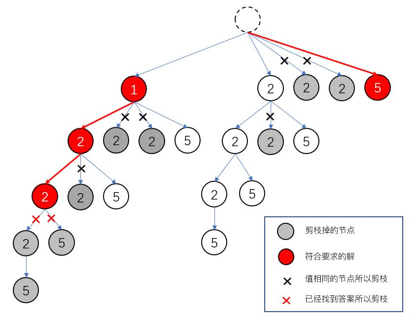

## 40. Combination Sum II

- 难度： 中等
- 通过率： 39.2%
- 题目链接：[https://leetcode.com/problems/combination-sum-ii](https://leetcode.com/problems/combination-sum-ii)


## 题目描述

来源于 [https://leetcode-cn.com/](https://leetcode-cn.com/)

<p>给定一个数组&nbsp;<code>candidates</code>&nbsp;和一个目标数&nbsp;<code>target</code>&nbsp;，找出&nbsp;<code>candidates</code>&nbsp;中所有可以使数字和为&nbsp;<code>target</code>&nbsp;的组合。</p>

<p><code>candidates</code>&nbsp;中的每个数字在每个组合中只能使用一次。</p>

<p><strong>说明：</strong></p>

<ul>
	<li>所有数字（包括目标数）都是正整数。</li>
	<li>解集不能包含重复的组合。&nbsp;</li>
</ul>

<p><strong>示例&nbsp;1:</strong></p>

<pre><strong>输入:</strong> candidates =&nbsp;<code>[10,1,2,7,6,1,5]</code>, target =&nbsp;<code>8</code>,
<strong>所求解集为:</strong>
[
  [1, 7],
  [1, 2, 5],
  [2, 6],
  [1, 1, 6]
]
</pre>

<p><strong>示例&nbsp;2:</strong></p>

<pre><strong>输入:</strong> candidates =&nbsp;[2,5,2,1,2], target =&nbsp;5,
<strong>所求解集为:</strong>
[
&nbsp; [1,2,2],
&nbsp; [5]
]</pre>


## 解法：

本题和 [39. Combination Sum](./039-combination-sum.md) 的区别在于本题中存在重复元素，且同一个元素不能多次使用。如果采用[ 39 题的解法](./039-combination-sum.md)，会出现重复。但只需要稍做改动即可。

和前一道题相比，本题的解空间小了很多，如下图所示：



一个节点下如果存在多个值相同的子节点，那么只取其中一个，其他分支被剪掉。在 `candidates` 中该节点对应值后面的数，构成该节点的子节点。

对数组进行排序，就可以快速跳过值相同的子节点了，本题中排序的作用体现在这里。

解答如下：

```python
class Solution:
    def combinationSum2(self, candidates, target):
        """
        :type candidates: List[int]
        :type target: int
        :rtype: List[List[int]]
        """
        # 保存遍历过程中遇到的可行解
        results = []
        candidates.sort()
        self._combinationSum(candidates, 0, [], target, results)
        
        return results
        
    
    # 这里的参数 i 用于记录当前遍历的值是数组中的第几个元素，
    # 因为在下一层遍历过程中，不需要考虑此下标之前的那些元素。
    def _combinationSum(self, candidates, i, nums, target, results):
        last = -1
        for j in range(i, len(candidates)):
            n = candidates[j]
            
            # 值相同的子节点只取第一个
            if n == last:
                continue

            last = n
            
            if n == target:
                results.append(nums + [n])
            elif n < target:
                self._combinationSum(candidates, j+1, nums + [n], target - n, results)
```