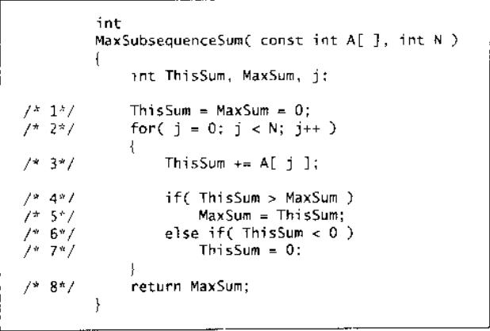

## 53. Maximum Subarray

- 难度： 简单
- 通过率： 42.2%
- 题目链接：[https://leetcode.com/problems/maximum-subarray](https://leetcode.com/problems/maximum-subarray)


## 题目描述

来源于 [https://leetcode-cn.com/](https://leetcode-cn.com/)

<p>给定一个整数数组 <code>nums</code>&nbsp;，找到一个具有最大和的连续子数组（子数组最少包含一个元素），返回其最大和。</p>

<p><strong>示例:</strong></p>

<pre><strong>输入:</strong> [-2,1,-3,4,-1,2,1,-5,4],
<strong>输出:</strong> 6
<strong>解释:</strong>&nbsp;连续子数组&nbsp;[4,-1,2,1] 的和最大，为&nbsp;6。
</pre>

<p><strong>进阶:</strong></p>

<p>如果你已经实现复杂度为 O(<em>n</em>) 的解法，尝试使用更为精妙的分治法求解。</p>


## 解法：

第一次看到这个问题是在《数据结构与算法分析》的第一章，作者给出了这个问题的至少 3 个解，暴力搜索、分治、和下面这个方法，下面这个方法算是最容易理解，也最为高效的。

理解此算法的核心在于把握下面这一点：

1. 一个值为负的元素不可能是最大子序列的第一个元素
2. 和为负的子序列不可能是最大子序列的前缀序列

《数据结构与算法分析》中解法如下：



但是**此算法对于本题不能得出正确的解**，问题在于如果数组全部为负数，这个算法会给出长度为 0 的子序列，这不符合本题题目要求。这是因为此算法认为最大子序列和不能为负，即 `max_sum` 不会小于 0，当数组中所有元素均为负时，那就出错了。

所以上面的第一条结论在此处不适用：

1. ~~一个值为负的元素不可能是最大子序列的第一个元素~~
2. 和为负的子序列不可能是最大子序列的前缀序列

因此本题需要做如下改变：

1. 修改 `max_sum` 的初始值为 `nums[0]`
2. 将 `esle if` 修改为 `if`，因为就算 `sum_ > max_sum`，`sum_` 也有可能小于 0。

本题 Aaccept 的代码如下：

```python
class Solution:
    def maxSubArray(self, nums):
        max_sum = nums[0]
        sum_ = 0
        
        for n in nums:
            sum_ += n
            if sum_ > max_sum:
                max_sum = sum_

            if sum_ < 0:
                sum_ = 0
                
        return max_sum
```